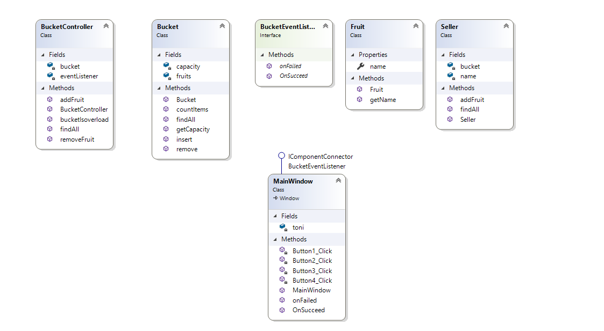

# Fresh Fruit

## 1. Fungsi Class `BucketEventListener.cs`

Fungsi class tersebut yaitu untuk membuat interface yang menampung method `OnSucceed` dan `OnFaile` yang memberikan message ketika berhasil maupun tidak berhasil ketika menambahkan item

## 2. ClassDiagram

## 3. Pembahasan Alur Logika Pemrogramannya
  
 Diawali dengan class `Bucket.cs` yang berfungsi untuk menampung buah dan kemudian class `Fruits.cs` untuk menampung jenis buah dan class `Seller.cs` digunakan untuk mengatur seller, kemudian terdapat pop up ketika berhasil atau tidak berhasil menambahkan buah diatur dalam class interface `BucketEventListener.cs` dan yang terakhir pada class `MainWindow.xaml.cs` yang mengatur dan menggabungkan keseluruhan antar Bucket, Fruit dan Seller dan yang mengatur banyak buah yang dapat ditambahkan